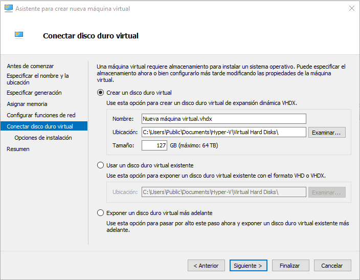
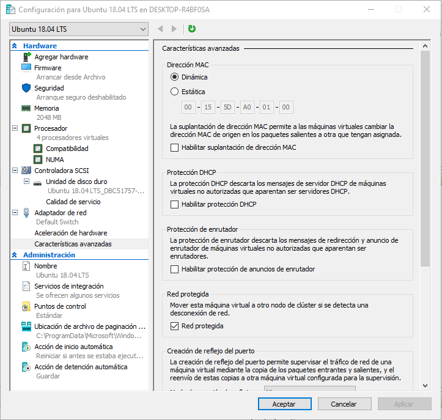
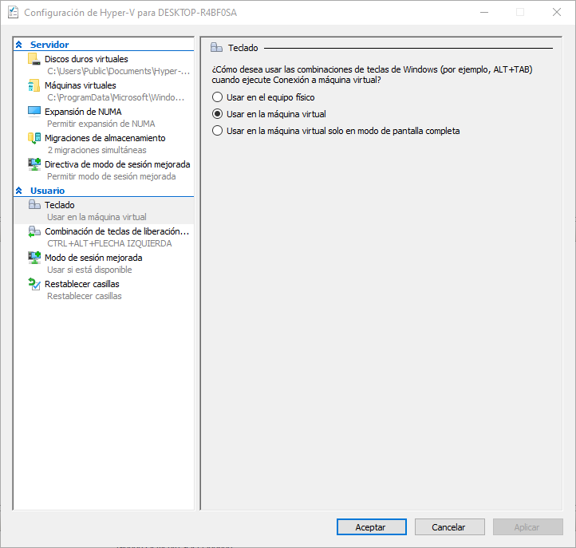
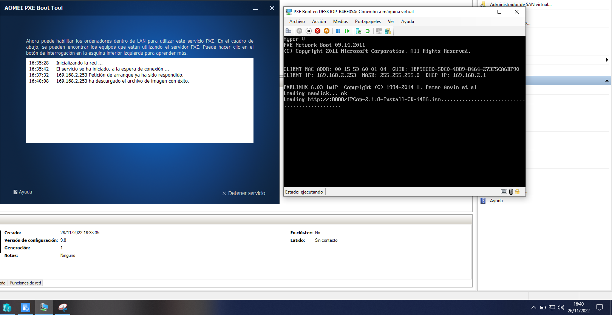
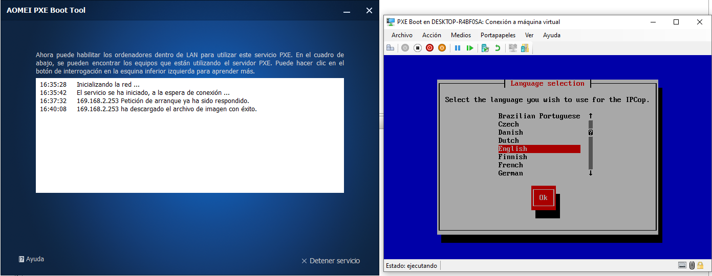
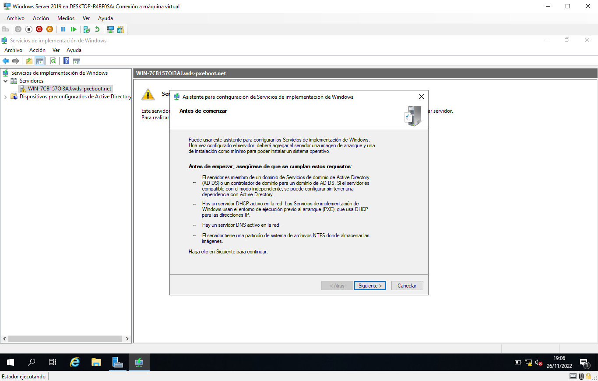
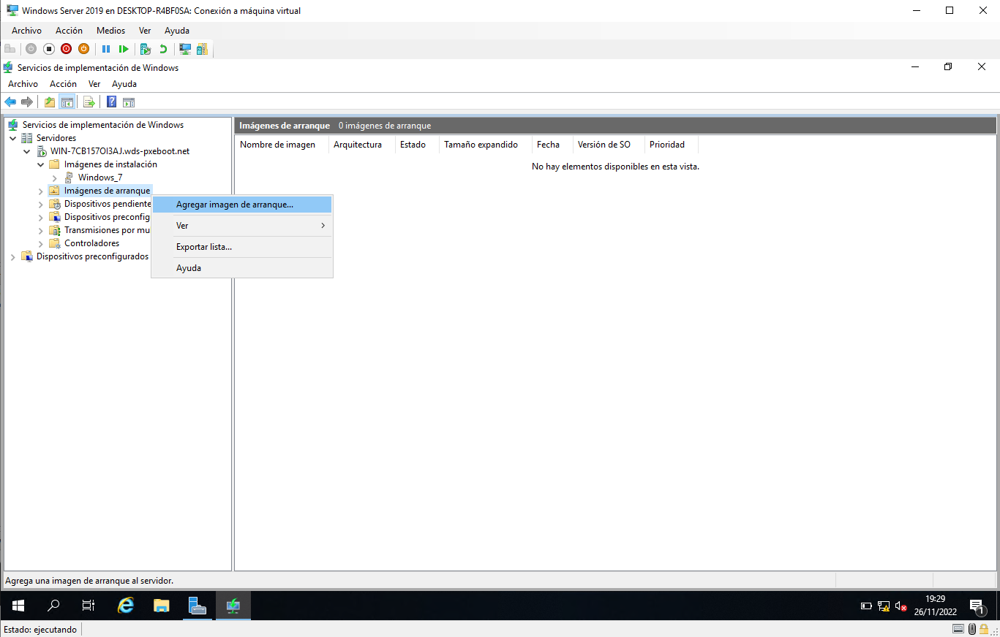
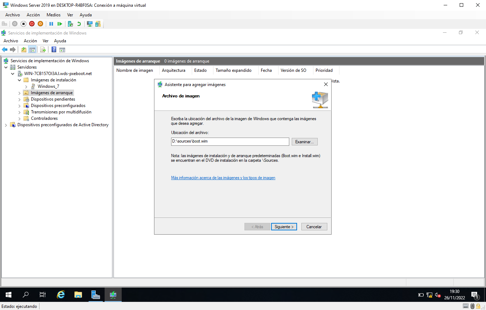

# proyecto-aso-primer-trimestre

# Hyper-V

Es un software nativo de Microsoft que permite la creación de máquinas virtuales en los sistemas operativos Windows que permitan la virtualización.

## Virtualización

La virtualización es la **creación de máquinas con sistemas operativos virtuales** que imitan las características de la máquina anfitrión en la que se aloja, nos permite usar distintos sistemas operativos sin tener que instalarlo en la máquina física y quitar el sistema operativo que tuviese en su momento. También sirven para hacer pruebas, realizar configuración en el sistema operativo y comprobar los efectos de dicha configuración, etc.

### Tipos de hipervisores

Tenemos dos tipos de hipervisores, los de tipo 1 y los de tipo 2.

+ **Hipervisor tipo 1:** También son llamados **hipervisores bare metal**, son los que se ejecutan directamente en el hardware de la máquina que aloja a la máquina virtual y son más rápidos que los hipervisores de tipo 2.

+ **Hipervisor tipo 2:** También son llamados **alojados**, simulan el hardware mediante el software, como si fuesen un programa más.

## Requisitos para usar Hyper-V u otro programa de virtualización

Para poder usar Hyper-V tenemos que disponer de un procesador que tenga virtualización, en el caso de que sea un procesador de Intel deberá tener la característica **VT-x** y en el caso de AMD deberá tener AMD-V, en el caso de que no dispusiera, no se podría realizar virtualización con ningún programa destinado a ello.

En el caso de que el procesador disponga de alguna de las dos características anteriores, **deberemos activar en la BIOS o en UEFI la característica de virtualización**, dependiendo del tipo de BIOS y del fabricante puede variar el nombre y localización.

## Activación de Hyper-V

Una vez tengamos la virtualización activada, en el menú de Inicio de Windows buscaremos **Activar o desactivar las características de Windows** y abriremos el resultado marcado en la imagen.

Esperaremos a que se cargue toda la información y en cuanto tengamos las características, marcaremos para activar **Hyper-V**, **Plataforma de máquina virtual** y **Plataforma del hipervisor de Windows** y pulsaremos en el botón de Aceptar.

Se harán cambios en el equipo y esperaremos a que finalicen, una vez finalizados, nos pedirá reiniciar el equipo para que se apliquen los cambios.

## Uso del Administrador de Hyper-V

Tras que se complete el reinicio del equipo, buscaremos en el menú de Inicio **Administrador de Hyper-V** y abriremos la aplicación.

### Creación de máquinas virtuales

Dentro del Administrador de Hyper-V, tenemos dos formas de crear máquinas virtuales, mediante **Creación rápida...** o mediante **Nuevo**, empezaremos con la opción **Creación rápida...**

Disponemos de varias "máquinas virtuales", estas máquinas tienen un lado bueno y otro malo, el bueno es que vienen con la mayoría de la instalación realizada y el malo es que hay que descargarlas (el lado malo depende de la conectividad principalmente). De momento hay estas 5, la máquina virtual **Windows 10 MSIX Packaging Environment** es una máquina personalizada para trabajar con con tareas de configuración limitadas. La máquina **Entorno de desarrollo de Windows 11** viene con programas como **Visual Studio 2022 Community Edition**, **NET Desktop**, **Azure** y **SDK**, también tiene **WSL 2 con una máquina Ubuntu** y el **modo desarrollador habilitado**.

Probaremos una de las máquinas, en concreto con **Ubuntu 18.04 LTS**, **la marcaremos** y pulsaremos el botón de **Crear máquina virtual** y vemos diferentes fases por las que pasa hasta que se crea la máquina virtual.

Una vez termina la descarga y extracción, nos sale una notificación indicando que la máquina se creó y que podemos editar la configuración o conectarnos con la máquina, continuaremos con la conexión.

Se nos abrirá la ventana de la máquina virtual y vemos que hay diferentes opciones, podemos pulsar en el **botón verde** para iniciarla o directamente en **Iniciar**.

Tras realizar la configuración del idioma, la distribución de teclado, la zona horaria y la creación del usuario, vemos que realiza configuración posterior que apenas lleva tiempo y nos permite usar la máquina poco después de terminar de configurarla.

Podemos elegir otras opciones de creación de máquinas virtuales que las que hay por defecto, volveremos de nuevo a la ventana principal de creación rápida y pulsaremos sobre **Origen de instalación local**, según la máquina que vayamos a instalar, Windows o Linux, marcaremos (si es Windows) o desmarcaremos (si es Linux) la opción **Esta máquina ejecutará Windows** y pulsaremos sobre el botón **Cambiar el origen de instalación** y poder instalar mediante un archivo de imagen (ISO) o desde un disco duro virtual (VHD o VHDX). Iré al directorio de mi disco duro externo en el que tengo los archivos **.ISO** para realizar la comprobación.

Volveremos al menú principal del **Administrador de Hyper-V** y veremos la otra opción **Nuevo**, nos dará tres posibilidades, crear una **máquina virtual**, un **disco duro** o un **disquete**.

#### Creación de máquina virtual

Empezaremos con la opción **Máquina virtual**, mediante el asistente de creación de máquinas virtuales crearemos una máquina, primero pondremos el nombre para la máquina y también nos permite especificar la ruta de la máquina virtual.

A continuación, nos permite seleccionar la generación, **la primera generación está basada en BIOS legacy y en los sistemas operativos de 32 y 64 bits**, luego tenemos **la segunda generación que está basada en UEFI, en máquinas de 64 bits y tiene características de virtualización** dentro de la propia máquina.

El siguiente paso es indicar la cantidad de memoria RAM que vamos a destinar a la máquina, también podemos marcar o desmarcar la opción **Usar memoria dinámica para esta máquina virtual** que permite a la máquina coger más memoria RAM si la necesitara durante el transcurso de su ejecución hasta un máximo establecido en la máquina virtual.

El siguiente apartado nos permite seleccionar el conmutador de red para nuestra máquina, hay dos opciones por defecto, **No conectado** y **Default Switch**, ambas opciones no disponen de conectividad fuera de la máquina anfitrión, por lo que para que una máquina disponga de conectividad tendríamos que crear un conmutador.

Antes de terminar, tendremos varias opciones relacionadas con el disco duro de la máquina, podemos crear un disco duro y cambiar su ubicación, cambiarle el nombre y el tamaño o usar un disco virtual existente o no poner un disco duro en este momento.

Para finalizar, podremos escoger la opción de instalación del sistema operativo que queramos, mediante **CD/DVD-ROM**, **disquete de arranque**, **instalación mediante red** y **no establecer todavía la instalación**.

#### Creación de disco duro

Tenemos la posibilidad de crear discos duros virtuales en caso de necesitarlos, como agregar un segundo disco duro a una máquina o añadir un disco a una máquina que no tiene disco en el que almacenar el sistema operativo.

Empezaremos seleccionando el tipo de disco duro, tenemos varias posibilidades, **VHD** para un **tamaño máximo de 2TB y cualquier tipo de sistema operativo**, **VHDX** para un **tamaño máximo de 64TB y sistemas operativos posteriores a Windows 8**, y por último, **Conjunto de VHD**, que permite **realizar copias de seguridad de grupos de máquinas** y es **para máquinas con Windows 10 y Windows 11**.

Disponemos de tres opciones de tipo de disco duro, de tamaño fijo, expansión dinámica y diferenciación.

+ **Expansión dinámica**: Se asigna una cantidad de espacio en disco y va aumentando según se vaya llenando el disco duro.
+ **Diferenciación**: Permite usar un disco para revertir los cambios realizados en el otro disco, es necesario que ambos tengan el mismo tipo de formato.

Podemos asignar un nombre al disco duro y cambiar su ubicación en el sistema anfitrión.

Por último, podemos crear el disco duro con un tamaño, usar un dispositivo real o copiar un disco duro al nuevo, como si se hiciese una clonación del disco.

### Exportación e importación de máquinas virtuales

Con las máquinas virtuales que hemos creado podemos exportarlas e importarlas para llevarlas en una unidad USB o a otro equipo.

#### Exportación de una máquina virtual

**Exportaremos la máquina Ubuntu 18.04 a un disco duro externo**, abriremos su menú contextual, click derecho de ratón, y pulsaremos en **Exportar...**

Después nos saldrá un diálogo indicando que establezcamos la ruta en la que exportaremos la máquina virtual, bien **escribiendo la ruta** o mediante el botón de **Examinar**.

Justo **en la sexta columna de Máquinas virtuales**, vemos que nos **indica el proceso de exportación**.

#### Importación de una máquina virtual

Para realizar la importación de una máquina, en el panel lateral derecho, pulsaremos en **Importar máquina virtual...**. Se abrirá una ventana e indicaremos la ruta exacta dónde se encuentra la máquina virtual, como antes la hemos exportado a **D:\Exportación Hyper-V\\**, tenemos que hacer referencia esta vez a su directorio, **Ubuntu 18.04 LTS** para poder realizar la importación de la máquina.

Nos saldrá la máquina virtual que hemos exportado y la seleccionaremos.

Tenemos varios tipos de importación, **Registrar**, **Restaurar** y **Copiar la máquina virtual**.

+ **Registrar la máquina**: Registra la ubicación de la máquina, quedando en la misma ubicación la máquina virtual.

+ **Restaurar la máquina**: Copia la máquina virtual a una ubicación elegida por el usuario.

+ **Copiar la máquina**: Copia la máquina virtual a una ubicación elegida por el usuario y se genera un nuevo identificador, pudiendo importar la misma máquina varias veces en un mismo equipo.

### Configuración de la máquina virtual

Para acceder a la configuración de la máquina, abriremos su menú contextual y pincharemos en **Configuración...**

Podemos agregar una controladora SCSI para discos duros, un adaptador de red o un adaptador de canal de fibra óptica.

En la sección de **Firmware** podemos elegir el orden de arranque de la máquina virtual.

En **Seguridad** podemos habilitar el arranque seguro para que no se ejecute código no autorizado durante el arranque del sistema operativo de la máquina, también podemos habilitar el TPM e incluso cifrar el estado y el tráfico de migración de la máquina y habilitar el blindaje de la máquina, permite ejecutar la máquina en un host o hosts escogidos.

De base podemos establecer la memoria máxima que tendrá la máquina virtual, también podemos establecer si usará la característica de memoria dinámica, escogiendo un mínimo y un máximo para su ejecución que será en función de las necesidades de la máquina. También podemos establecer un buffer de memoria para almacenar datos en la memoria. Y por último podemos establecer la prioridad de esta máquina con respecto a otras que se estén ejecutando al mismo momento para la asignación de memoria principal física.

En la sección de **Procesador** tenemos la asignación de procesadores virtuales para la máquina y el control de recursos entre las máquinas virtuales que haya en ejecución. Dentro de esta sección tenemos tanto **Compatibilidad** como **NUMA**.

+ **Compatibilidad**: Limita las características del procesador de la máquina para que nos permita migrar la máquina a otro equipo con una versión distinta de procesador.

+ **NUMA**: **Non-Uniform Memory Access** es una arquitectura que se usa cuando algunas regiones de memoria tienen latencias de acceso mayores, esta arquitectura permite alojar en un nodo NUMA la memoria principal de la máquina siempre que haya suficiente espacio permitiendo un incremento del rendimiento del sistema.

Podemos añadir varios dispositivos SCSI a la máquina, un disco duro, un DVD o una unidad compartida, también podemos quitar los dispositivos anteriores.

Dentro de la sección **Controladora SCSI** tenemos las **Unidades de disco duro** que nos permite establecer la forma de conexión del disco duro, cambiar su ubicación, crear uno nuevo, modificarlo o ver sus características.

Nos permite seleccionar el adaptador de red que necesitemos para nuestra máquina virtual, habilitar la VLAN y el administrador de ancho de banda. Dentro de esta sección disponemos de **Aceleración de hardware** y **Características avanzadas**.

+ **Aceleración de harware**: Nos permite especificar las tareas de red que se pueden descargar en un adaptador de red físico, como **Virtual Machine Queue** que es un mecanismo para administrar el tráfico de red en la tarjeta de red física, evitando uso de CPU y latencia de red. También tenemos IPSec que es un estándar para otorgar seguridad a la capa 3 de OSI o la capa 2 de TCP/IP.

+ **Características avanzadas**: Podemos especificar una dirección MAC dinámica para los adaptadores de red, asignar una MAC estática y suplantación de MAC, habilitar protección DHCP, protección de anuncios de enrutador, red protegida, creación de reflejo de puerto para supervisar el tráfico de red mediante la copia de los paquetes entrantes y salientes a otra máquina virtual y la formación de equipos de NIC.

Nos permite activar o desactivar varios servicios integrados como Apagado del sistema operativo, Sincronización de hora, Intercambio de datos, Latido (comprobación del arranque de la máquina), Copia de seguridad y Servicios invitados para poder copiar archivos de una máquina al sistema anfitrión y viceversa.

Los puntos de control son instantáneas de la máquina que guardan su estado actual cuando se realiza el punto de control, se puede hacer con la máquina apagada o encendida, podemos establecer puntos de control automáticos y la ubicación de dichos puntos de control.

El archivo de paginación inteligente **permite el uso de la memoria virtual**, permitiendo que si se queda corta de memoria principal, use el disco duro como almacenamiento para los procesos y se cargue en memoria principal una parte de los procesos. Podemos únicamente establecer la ubicación de dicho archivo.

Podemos establecer si queremos que la máquina de inicie automáticamente tras un lapso de tiempo, que se ejecute automáticamente si estaba en ejecución durante la detención del servicio y que no se inicie automáticamente.

Por último tenemos la acción de detención automática que permite apagar, guardar el estado o desconectar la máquina si el equipo se va a apagar.

### Configuración de Hyper-V

Dentro de Hyper-V podemos realizar configuración general sobre el servicio y tenemos las siguientes opciones:

+ **Discos duros virtuales**: Nos permite establecer la ruta por defecto para todos los discos duros que creemos.

+ **Máquinas virtuales**: Nos permite establecer la ubicación de la configuración de la máquina virtual en otro directorio o ruta.

+ **Expansión de NUMA**: Podemos activar o desactivar la característica para que las máquinas se expandan a nodos NUMA físicos.

+ **Migraciones de almacenamiento**: Podemos establecer la cantidad de migraciones simultáneas.

+ **Directiva de modo de sesión mejorada**: Podemos activar o desactivar el uso de sesión mejorada que permite el redireccionamiento de dispositivos como unidades USB y recursos del equipo.

+ **Teclado**: Podemos establecer el uso de algunas teclas de Windows para que se usen únicamente en el equipo físico, en máquina virtual o en máquina virtual con pantalla completa.

+ **Combinación de teclas de liberación**: Podemos escoger alguna combinación de la lista para cuando no haya disponible un ratón.

+ **Modo de sesión mejorada**: Podemos establecer si queremos usar la sesión mejorada o no.

### Administrador de conmutadores virtuales

Hyper-V nos permite crear y quitar conmutadores de red o cambiar su configuración para adecuarla a las necesidades de la máquina virtual.

Por defecto tenemos un Switch virtual que no dispone de conexión fuera de una red interna ya que únicamente su ámbito es la comunicación local entre las máquinas y el equipo anfitrión. 

Podemos establecer un rango de direcciones MAC para las máquinas que tengan la configuración dinámica de dirección MAC.

Para crear un conmutador de red, pincharemos en **Nuevo conmutador de red virtual**, nos da tres opciones para el conmutador, **Externa** para proporcionar acceso a la red física y tener conectividad, **Interna** para comunicación entre las máquinas y el equipo anfitrión y **Privada** que únicamente la comunicación es entre las máquinas virtuales. Una vez sepamos el tipo de conmutador, pulsaremos en el botón **Crear conmutador virtual**.

Dentro del nuevo conmutador, podemos establecer el nombre que tendrá, la interfaz de salida si es red externa o los otros dos tipos de conmutadores, también especificar la VLAN a la que pertenecerá.

### Administrador de SAN virtual

Podemos crear un SAN para el almacenamiento mediante un canal de fibra. Para crear el canal, tendremos que pulsar el botón **Crear**.

En mi caso, como no tengo puerto de canal de fibra, no puedo realizar un SAN.

### Editar disco

Nos permite realizar cambios en el disco duro, para ello, escogeremos el disco que queremos cambiar.

Una vez escogido el disco, podemos realizar tres acciones sobre él:

+ **Compactarlo**: Nos permite hacer el archivo de disco duro más pequeño, de forma que la capacidad de almacenamiento sigue igual.

+ **Convertirlo**: Podemos cambiar su formato mediante la copia del contenido del disco duro a otro disco con distinto formato, VHD o VHDX.

+ **Expandirlo**: Podemos aumentar la capacidad del disco duro.

### Inspeccionar disco

Nos da información sobre un disco duro en cuestión.

### Servicio de Hyper-V

**Hyper-V es un servicio** de virtualización, por lo que podemos detener el servicio, quitarlo, actualizarlo o iniciarlo.

### Puntos de control

Hyper-V tiene un sistema de puntos de control que nos permite guardar estados de la máquina para posteriormente volver a ellos si fuese necesario, además de otras opciones que veremos un poco después.

Cuando seleccionamos una máquina virtual, justo debajo veremos un apartado, **Puntos de control**, nos permitirá administrar los puntos de control para la máquina virtual.

Las acciones que podemos realizar sobre los puntos de control son:

+ **Aplicar**: Usar un punto de control guardado.

+ **Exportar**: Exportar un punto de control a otra ubicación.

+ **Cambiar nombre**: Podemos identificar el punto de control mediante otro nombre, como por ejemplo --> Instalación de servidor Apache2

+ **Eliminar punto de control**: Podemos eliminar un punto de control que no vayamos a necesitar o que no funcione debido a una configuración incorrecta dentro de la máquina virtual, como por ejemplo **Remove-Item -Path C:\Windows\System32 -Recurse** (con permisos de administrador).

+ **Eliminar subárbol de punto de control**: Elimina todos los puntos de control que dependen del punto de control superior borrado.

### Conexión a servidor Hyper-V

Como Hyper-V es un servicio, podemos conectarnos a otros equipos o incluso a un Windows Server 2016 o 2019 con el rol de Hyper-V instalado y ejecutar máquinas virtuales remotas, crearlas, configurarlas o eliminarlas. Para conectarnos a otro equipo o a un servidor, tenemos que **abrir el menú contextual del Administrador de Hyper-V** y pinchar en **Conectar al servidor...**

Veremos que tenemos dos opciones, **Equipo local** y **Otro Equipo**, si escogemos Otro equipo, tendremos que poder su dirección IP o su FQDN directamente o pulsar en el botón **Examinar...** para buscar dicho equipo. También podemos establecer el usuario con el que nos conectaríamos.

### Operaciones sobre la máquina virtual

Podemos usar varias acciones sobre una máquina virtual, encendida o apagada.

Empezaremos con la máquina virtual apagada y vemos que hay algunos **botones que están en gris** (deshabilitados debido al estado de la máquina) y otros que no lo están (activados para realizar acciones sobre la máquina).

+ **Iniciar**: Es el primer botón "normal" empezando por la izquierda, nos permite iniciar la máquina.

+ **Punto de control**: Nos permite realizar un punto de control de la máquina.

+ **Revertir**: Podemos usar otro punto de control que tenía la máquina guardado.

+ **Compartir**: Nos permite compartir la máquina virtual mediante un formato **.vmcz**.

Al igual que nos pasaba con la máquina apagada, una vez está la máquina encendida disponemos de acciones sobre ella, empezando por la izquierda:

+ **Ctrl + Alt + Supr**: Nos permite usar dicha combinación de teclas en la máquina virtual.

+ **Desconectar**: Nos permite apagar la máquina de forma bruta, como si quitásemos la batería a un portátil o el cable de corriente de la fuente de alimentación del ordenador.

+ **Apagar**.

+ **Guardar**: Guarda el estado actual de la máquina.

+ **Pausar**.

+ **Restablecer**: Reinicia la máquina.

+ **Punto de control**.

+ **Sesión mejorada**(segundo por la derecha).

En la pestaña **Medios** podemos insertar o expulsar unidades DVD o disquete.

En la pestaña **Portapapeles** podemos pasar un texto del portapapeles a la máquina o hacer captura de pantalla.

En la pestaña **Ver** podemos poner la pantalla completa, mostrar la barra de herramientas, usar la sesión mejorada o establecer el nivel de zoom.

### PXE Boot

Crearemos dos máquinas virtuales que se conectarán mediante **AOMEI PXE Boot** y **WDS** para realizar la instalación del sistema operativo IPCop (AOMEI PXE Boot) y Windows 7 (WDS) en las máquinas virtuales.

#### AOMEI PXE Boot

Primero realizaremos el proceso usando AOMEI PXE Boot, para ello hay que descargar **AOMEI Backupper** de prueba de 30 días e instalar el programa, después iremos a **Herramientas** que se encuentra en el panel lateral izquierdo. Buscaremos el apartado **Herramientas de respaldo** y veremos que hay tres opciones la primera **PXE Boot Tool** es la que usaremos ya que es la que viene con la prueba, la buena es la segunda, **Image Deploy** pero no viene con la prueba del programa. Iniciaremos AOMEI PXE Boot Tool y seleccionaremos la opción **Arrancar desde archivo de imagen personalizada** y buscaremos una ISO de poco tamaño y tenemos que evitar que tenga espacios en el nombre, ya que daría problemas. Cuando tengamos la ISO, pulsaremos en el botón **Iniciar servicio** y mientras se iniciar, crearemos la máquina virtual.

Tenemos que usar la opción **Nuevo** para crear la máquina, no Creación rápida, ya que podremos escoger la mayoría de la configuración para la máquina. Es importante escoger el conmutador de red correcto y cuando nos pida escoger el medio de instalación, marcaremos **Instalar un sistema operativo desde un servidor de instalación en red**. Nos tiene que salir algo similar a la imagen.

Cuando tengamos la máquina creada, comprobaremos que el servicio está a la espera de conexión e iniciaremos la máquina. Si la configuración de red o el servicio están correctos, debería tener el cliente una dirección IP y tendría que iniciar al poco después la descarga de la ISO.

En esta siguiente imagen comprobamos que la máquina virtual está conectada al servicio PXE Boot.

Cuando termina de descargar la ISO y comprobarla, inicia la instalación del sistema operativo en la máquina virtual.

#### WDS

Windows Deployment Service permite al igual que la anterior herramienta realizar la instalación de sistemas operativos en red, es un servicio que como veremos un poco más adelante, requiere un servidor de **DNS**, otro de **DHCP** ejecutándose, **NTFS** como sistema de archivos y **Active Directory**. Una vez tengamos todo preparado y configurado, buscaremos el rol de servidor **Servicios de Implementación de Windows** y realizaremos la instalación por defecto del servicio. Cuando esté instalado, abriremos el menú contextual del servidor y pulsaremos en **Configurar servidor**.

Cuando se abra el asistente de configuración, veremos primero los requisitos para que WDS funcione.

Tenemos que escoger la opción **Integrado con Active Directory** para que coja todos los servicios que hemos implementado.

Después escogeremos la ruta de ubicación de las imágenes de arranque e instalación, se puede dejar en el disco del sistema o en un segundo disco.

En **Servidor proxy DHCP** dejaremos las opciones por defecto.

Escogeremos **Responder a todos los equipos (conocidos y desconocidos)** para que el servicio responda a la máquina virtual que crearemos después y continuaremos por defecto hasta finalizar con el asistente.

Abriremos el desplegable del servidor y abriremos el menú contextual de **Imágenes de instalación** y seleccionaremos **Agregar imagen de instalación...**

Como voy a usar una ISO de Windows 7, al nombre del grupo le pondré un identificador para diferenciarlo de otros.

Desde **Medios agregaremos la ISO de Windows 7** y pulsaremos en **Examinar**, **buscaremos en la ISO el archivo install.wim**

Vemos que en el archivo hay distintas versiones de Windows 7, podemos seleccionar las que queramos agregar o dejar todas marcadas.

También tenemos que agregar la imagen de arranque para poder realizar la instalación desde la red, abriremos el menú contextual de **Imágenes de arranque** y pulsaremos en **Agregar imagen de arranque...**

Al igual que hicimos, buscaremos en la ISO el archivo **boot.wim** que nos permite realizar el arranque.

Por defecto nos pondrá el nombre y la descripción que contiene la imagen de arranque, podemos cambiarlas o dejarlas por defecto. Cuando terminemos de agregar las imágenes, iniciaremos el servicio para poder realizar la instalación de Windows 7 en la máquina virtual que crearemos después, abriremos el menú contextual del servidor y en la opción **Todas las tareas** nos saldrá un desplegable y pincharemos en **Iniciar**.

Al igual que hicimos con la máquina para AOMEI PXE Boot, crearemos una máquina virtual y le asignaremos un conmutador de red y que la instalación del sistema operativo se realizará desde la red.

Arrancaremos la máquina y vemos que recibe una dirección IP del servicio de DHCP y **nos indica que para arrancar el servicio de red tenemos que pulsar la tecla F12**, si pasa unos pocos segundos y no la pulsamos nos saldrá que PXE Boot está abortado. Cuando pasa esto, tenemos que reiniciar la máquina y estar pendientes del mensaje.

Cuando nos salga de nuevo el mensaje y pulsemos la techa **F12**, se empezará a descargar unos archivos para realizar la instalación en red.

Cuando terminen de descargarse los archivos, accederemos a la instalación del sistema operativo.

